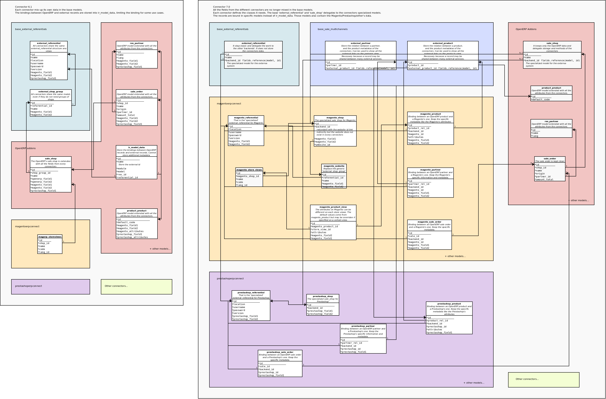

.. _connectors-specifications:

Connectors Specifications
=========================

The framework to develop connectors (like Magentoerpconnect_) is
decoupled in small pieces of codes interacting together.

This document describes the high-level specifications for each piece.

.. _Magentoerpconnect: http://code.launchpad.net/magentoerpconnect

Events
------

Events are hooks in OpenERP on which we can plug some actions. They are
based on an Observer pattern.

The basic idea is to declare an event, for instance `on_record_create`.
Then each connector is able to subscribe one or many function on it. The
creation of a record should fire `on_record_create`, and that will
trigger all the subscribed functions.

We must be able to:

* register a new function on an event
* unregister a function from an event
* so, it means also replace a function by another
* filter the events by model, so a subscribed function will be triggered
  only if the event happens on a registered model

Queue
-----

This section summarises the Queue which is in fact a grouping of 3 notions,
which are jobs, a worker, and the queue itself.

  Job

    A job is a delayed call waiting to be executed. It is stored in the
    `queue` before it is executed.

    It needs to store at least 2 things: the function to call and the
    arguments to pass to it.

    A job may need to be run at a certain time, for instance to delay a
    failed task to a later time, or to defer some expensive tasks during
    the night. So, a job could also have a 'later time'.

    We want some jobs to be run before others, according to a priority.
    Thus they have to store a priority.

    Jobs should be stored somewhere (PostgreSQL or other database) and
    not just kept into memory, because they have to survive to an
    OpenERP restart.

  Queue

    The queue stores the jobs before their execution. The queue has 2
    responsibilities: queue a job, dequeue a job. It should respect the
    priorities and the 'later time' of the jobs.

  Worker

    The worker is started alongside OpenERP. Its role is to take the
    jobs out of the queue and run them sequentially. It can uses
    thread(s) for instance.

    When OpenERP start, it has to take all the pending jobs from the
    database and queue them.

Potential issues:

* Start of the server: the pending jobs must be enqueued only in one
  queue when we have many processes using Gunicorn.
* Restart of processes: Gunicorn kills the processes based on some
  resources or time limits. We have to ensure that: the jobs are still
  in a queue, the jobs are not in 2 queues
* Sop of the server: a job executed jobs just before the stop of the
  server may be finished but not written as 'done' in the database.

References
----------

A reference represents a service and a version, for instance `Magento
1.7`. It holds lists of mappings, synchronizers, external adapters and
binders available.

A reference can have a parent. The instance `Magento 1.7` is the child
of `Magento`.

We should be able to ask to a reference the mapping class to use. For
instance, if I ask the mapping class for `res.partner` to `Magento 1.7`,
it must return me the class to use. If `Magento 1.7` has no mapping
registered, it returns the mapping registered on its parent. Same story
for each type of classes.

We must be able to unregister or register each class.

Mappings
--------

A mapping translates an external record to an OpenERP record and
conversely. This point is more complex than it can appear.

A mapping is applicable based on:

* a model
* a direction (OpenERP -> External, External -> OpenERP)

It should support:

* direct mappings: field `a` is written in field `b`
* method mappings: a method is used to convert one or many fields to one
  or many fields
* sub mappings: a sub record (lines of a sale order) is converted
* fields selection: smart selection of records to convert (only few
  fields have been modified on OpenERP, convert only them)
* merge of records: convert 2 external records in 1 OpenERP record or
  the reverse

Synchronizers
-------------

A synchronizer is an action with the external system. It can be a
record's import or export, a deletion of something, or anything else.
It will use the mappings to convert the data between both systems, the
external adapters to read or write data on the external system and the
binders to create the link between them.

External Adapters
-----------------

An external adapter has a common interface to speak with the external
system. It translates the basic orders (search, read, write) to an
underlying communication with the external system.

Binders
-------

Binders are classes which know how to find the external ID for an
OpenERP ID, how to find the OpenERP ID for an external ID and how to
create the binding between them.

Datamodel changes
-----------------

The datamodel used in Magentoerpconnect_ (and other connectors) in
version 6.1 is invasive. They add their own fields on each synchronized
models (products, partners, ...). This not only is a mess on the views,
but also becomes limitating for the extensibility of the connectors. For
instance, actually the Magento `email` fields is stored on
`res.partner`. The fact is that a partner could be shared between 2
Magento's websites with different email. Product attributes may be
different per shop.

Another issue is the storage of the bindings between records in
`ir.model-data`. This model allows to store an external id, an openerp
id, a model and a a referential. This is a limitation when we need more
granularity in the bindings (`website_id` for a partner) or when there
is no external id but a couple of keys (product links).

The solution here is to properly stores the bindings on relation tables
between the referentials and the records `Figure 1`_. These relation tables will
also be able to store the additional data like the product attributes.

.. _`Figure 1`:

   Datamodel structure for connectors V7.0

Naming
------

We need to agree on a clear naming for the concepts exposed here and some
of the existing ones.
